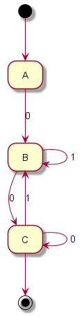

# Laboratory Work 2

### Course: Formal Languages & Finite Automata
### Author: Felicia Novac

----

## Theory
- The *Chomsky classification* of Grammar organizes languages into four levels based on their complexity, from simplest to most complex. The 4 types of Grammar are:
  - *Regular Grammar `Type 3`* - the most restricted form of the language, and the only one which is accepted by the FA. The lhs (left-hand side) of the production must have a single non-terminal and the rhs (right-hand side) consisting of a single terminal or a comb between a non-terminal and terminal.
  - *Context-Free Grammar `Type 2`* - the lhs of production can have only one variable and there is no restriction on the rhs.
  - *Context-Sensitive Grammar `Type 1`* - the count of symbols on the lhs must be less or equal to the count of symbols on the rhs.
  - *Unrestricted Grammar `Type 0`* - there are no restrictions, and typically when a Grammar is not of type 3, 2 or 1, it falls into the type 0 category.


- *Non-Deterministic FA* - there is an indeterminancy in the transitions, as with one single terminal, a state can go in more than one states. Also, there might be ε transitions, and in this case automaton is called ε-NFA.
- *Deterministic FA* - inverse of NFA.

- *NFA to DFA Conversion*:

  -  **Step 1:** Initially Q' = ϕ
  -  **Step 2:** Add q0 of NFA to Q'. Then find the transitions from this start state.
  -  **Step 3:** In Q', find the possible set of states for each input symbol. If this set of states is not in Q', then add it to Q'.
  -  **Step 4:** In DFA, the final state will be all the states which contain F(final states of NFA)
- *ε-NFA to DFA conversion* - requires one more step before converting NFA to DFA, which is determining ε-CLOSUREs.


## Objectives:

* Understand what an automaton is and what it can be used for.
* Provide a function in your grammar type/class that could classify the grammar based on Chomsky hierarchy.
* Implement conversion of a finite automaton to a regular grammar.
* Determine whether your FA is deterministic or non-deterministic.
* Implement some functionality that would convert an NDFA to a DFA.
* Represent the finite automaton graphically.
* Maintain mental health while creating FA graphs in Java (*optional*)


## Implementation description

### Chomsky Hierarcy
My `public Integer classifyGrammar()` method utilizes several integer flag variables to represent each grammar type. These `flags` are incremented whenever the method identifies one of the four types. Essentially, the method iterates over the production rules and invokes check methods to conduct the evaluations. It's important to highlight that I have distinguished the check for type 3 grammars from the checks for other types due to the unique considerations of right and left linearity in grammars. To accurately handle these cases, I introduced two boolean flag variables, `allProductionsAreRightLinear` and `allProductionsAreLeftLinear`, both initially set to true. This separation ensures precise identification by independently assessing linearity and designating the grammar as type 3 if either of these flag variables holds true. Following this, another iteration is set up to conduct evaluations for type 2 and type 1 grammars. If a production doesn't align with these categories, it is then classified as type 0. 

#### Type 3 check-up:
I have two helper methods to depict the productions which belong to type 3 `isRightLinear(String value)` and `isLeftLinear(String value)`. These methods, basically contain if-else statements, covering all possible cases for right/left-linearity acceptance. For instance, if a production has the RHS of length 1, the regular grammar accepts the terminals, non-terminals and even ε for both left and right linear grammars. While in particular for each method, there is a simple iteration to identify non-terminals to be either at the end or beginning of the String.

#### Type 2 check-up:
For checking the context-free grammars, we simply look at the LHS of the productions, which must have the `.length() = 1` and be a non-terminal at the same time. There are no restriction on the RHS.

#### Type 1 check-up:
The general case for Context-Sensitive Grammar, is that the LHS <= RHS, so put it as the main return boolean value. But before that, there are some particular cases with ε, as the transitions with it are permitted `S->ε` if and only if S is a start symbol, and does not appear on the RHS of any transitions.

```
 if (value.equals("ε") && !key.equals(S.toString())) {
            return false;
        }
        if (key.equals(S.toString()) && value.equals("ε")) {
            for (List<String> values : P.values()) {
                for (String val : values) {
                    if (val.contains(S.toString())) return false;
                }
            }
            return true;
        }
```

### FA to Regular Grammar conversion
My toRegularGrammar() method converts all variables from Finite Automata format to Grammar format, meaning all rules turn in productions, possible states in Vn, Σ in Vt.

For each transition in the automaton, it generates production rules where the left-hand side is the current state and the right-hand side is the concatenation of the transition symbol symbol and the target state. For states that are final in the automaton, it adds an ε-production, indicating that the grammar can produce an empty string from these states.

### NFA & DFA classification
My `is_dfa()` perform a check-up for NFA and ε_NFA, by iterating through all state transitions, and looking for any transitions based on a single input symbol that lead to multiple states (indicating nondeterminism) or that explicitly use "ε" (epsilon) to denote transitions that occur without consuming any input (also indicating nondeterminism).

### NFA & ε-NFA to DFA conversion

#### ε-CLOSUREs identification
An ε-closure includes the state itself and any states that can be reached by following transitions that consume no input (ε-transitions).
The method uses a stack to explore and add states to the closure set if they can be reached through ε-transitions. The method iterates through transitions, adding reachable states to the closure, and returns this set once all reachable states are explored.

```
private Set<Character> epsilonClosure(Character state, Map<Character, Map<Character, List<Character>>> transitions) {
        Set<Character> closure = new HashSet<>();
        Stack<Character> stack = new Stack<>();
        stack.push(state);

        while (!stack.isEmpty()) {
            Character currentState = stack.pop();
            closure.add(currentState);
            List<Character> epsilonTransitions = transitions.getOrDefault(currentState, new HashMap<>()).getOrDefault('ε', new ArrayList<>());
            for (Character nextState : epsilonTransitions) {
                if (!closure.contains(nextState)) {
                    stack.push(nextState);
                }
            }
        }

        return closure;
    }
```

### NFA to DFA conversion
For converting an NFA to DFA, I first initialized two maps to hold the Set of Characters from NFA with corresponding new value Character in the DFA `stateSetToDFAState`, and vice-versa `dfaStateToStateSet`. Also, some lists and maps for storing the DFA states, DFA final states and transitions were initialized. I have decided to start with the *A*  as initial state for the DFA, so compute the ε-closure for the initialState in NFA (S), and add it to the previously initialized maps and list of states. Additionally, add the ε-closure to the `Queue` with a `Set of Characters` representing closure. 

Process the queue, and retrieve the state for the given set in the `stateSetToDFAState` map in order to construct the transitions in DFA. Process the entire set, and for each state in set compute ε-closures, and for each state in the ε-closure retrieve reachable states based on the current symbol being processed from the alphabet. Finally, add next reachable states to another set, which will be nextStates set. If this *nextStates set* is not empty, add it to the DFA and queue. Also, add the next state to the transition map for the symbol in alphabet. Finally identify final states in DFA, by the rule that if the final state of the NFA is in the set of states in the DFA, the DFA state is a final state.

### FA Graph Representation
After a long research and several trials of implementing Java libraries for plotting the graphs, such as *GraphStream* and *JGraphX* , I have come with the solution of integrating the PlantUML into my project to graphically represent finite automata. By incorporating their `.jar` file, I enabled the `generatePngRepresentation()` method to automatically generate input for PlantUML. This process constructs a state diagram, illustrating each state connected by lines (transitions). As a result, when `generatePngRepresentation()` is invoked, a file named generated_finite_automaton.png is produced within the project's images folder. Below, you can view an example PlantUML diagram generated for my specific case:


<p align="center">
  
  <br>
  <em>Figure 1. Finite Automaton Visualization V. 17</em>
</p>


## Conclusions / Screenshots / Results

### Grammar Type Identification
I've tested the implementation on all four types of Grammar
Type 3                     |Type 2                     |Type 1                     |Type 0                    |
:-------------------------:|:-------------------------:|:-------------------------:|:-------------------------:
  |   |   |  |


As a conclusion, I managed to transpose the theoretical stuff learned at the lectures into code and construct my own language based on `Grammar` provided by the variant, and made the conversion of it to `FA`. Also, I fulfilled the given tasks of constructing the two classes, and the respective methods that they hold. I've also got an important point about the conversion to FA, as it is only valid for regular grammars (type 3). Overall, this laboratory work was insightful and made me understand better the basics of the FA and Grammars.


## References
